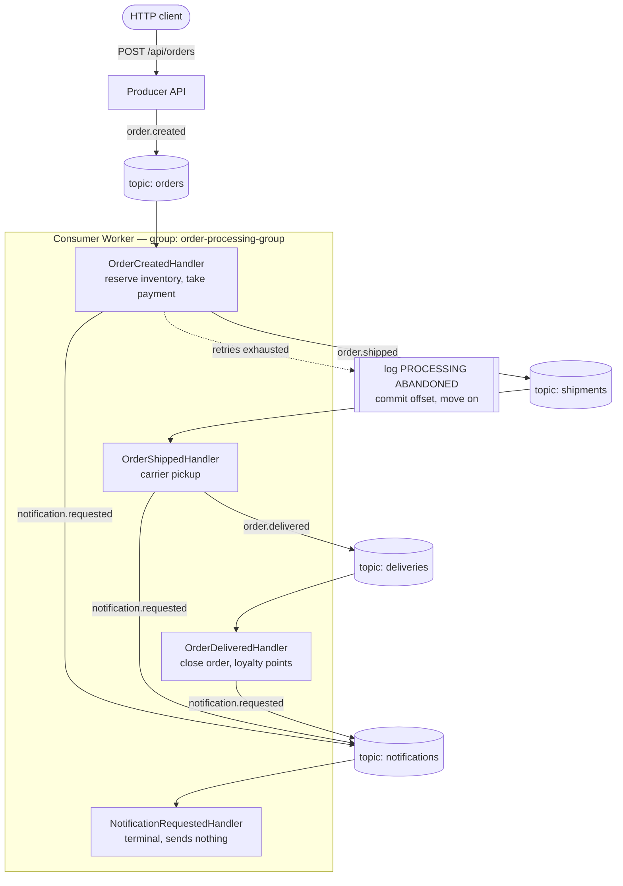

# Kafka Event-Driven Architecture in .Net 10

**Apache Kafka** is an open-source event streaming platform. Instead of services calling
each other directly, they communicate through **events** — small records of something that
happened, such as "an order was placed". Kafka receives those events, stores them on disk in
the order they arrived, and keeps them for a set period of time. Any number of services can
then read the same events at their own speed, and reading an event does not remove it. That
is what makes Kafka different from a normal message queue: a service that was switched off
can start again later and carry on from exactly where it stopped, without losing anything.

This project uses Kafka to build an order processing system in .NET. An HTTP service
publishes events, a separate worker service reads and processes them, both share the same
event contract, and failures are handled with retries before being logged and skipped.
Everything runs in Docker, including both .NET services.

### How data flows through Kafka

1. **A producer creates an event.** Something happens in the application — an order is
   placed — and the producer turns it into a message.

2. **The message is sent to a topic.** A topic is a named stream of messages, for example
   `orders`. The producer does not know or care which service will read it.

3. **The message goes into a partition.** Every topic is split into partitions so Kafka can
   handle many messages at the same time. Messages that share the same key always land on
   the same partition, which keeps related messages in the correct order.

4. **A broker stores it and assigns an offset.** The broker is the Kafka server. It appends
   the message to the partition on disk and gives it a number, the **offset**, marking its
   position in that partition.

5. **A consumer group subscribes to the topic.** A consumer group is one or more consumer
   instances working together. Kafka gives each partition to exactly one member of the
   group, so the work is shared and no message is processed twice.

6. **A consumer reads the message.** It fetches messages from the partitions assigned to it,
   in offset order.

7. **The application processes it.** This is the actual business logic — reserve stock, take
   payment, send an email.

8. **The consumer commits the offset.** It records how far it has got. If it restarts, it
   continues from that exact point instead of starting over or skipping messages.

In short:

```
Producer -> Topic -> Partition (on a Broker) -> Consumer Group -> Consumer -> Processing -> Offset Commit
```

Because messages stay on disk after being read, Kafka gives you high throughput,
scalability, fault tolerance, and the ability to replay past events whenever you need them.

### Kafka terms at a glance

| Term | Meaning |
|---|---|
| **Broker** | The Kafka server that stores messages on disk and serves them to readers |
| **Topic** | A named stream of messages, e.g. `orders` |
| **Partition** | An append-only slice of a topic; the unit of both parallelism and ordering |
| **Offset** | A message's numbered position inside its partition |
| **Producer** | Writes messages to a topic |
| **Consumer group** | Consumers sharing the work; each partition is read by exactly one member |
| **Offset commit** | Recording how far the group has processed, so it resumes correctly after a restart |

### How this maps onto the project

| Concept | Here |
|---|---|
| Broker | 1 container, `orderflow-kafka` |
| Topics | `orders`, `shipments`, `deliveries`, `notifications` |
| Partitions | 3 per topic, created explicitly at startup |
| Message key | `orderId`, so one order's events stay ordered on one partition |
| Producers | `Producer.Api` **and** the consumer's own handlers |
| Consumer group | `order-processing-group`, scalable to 3 useful instances |
| Commit mode | Manual, after success (`EnableAutoCommit = false`) |
| Where data lives | Broker log files in the `kafka-data` Docker volume, kept 24h |

---

## Prerequisites

Only **Docker Desktop** is strictly required. Kafka, ZooKeeper, both .NET services and the
web UI all run as containers, so you do not need Kafka, Java or even the .NET SDK installed.

| Tool | Needed for | Minimum | Where |
|---|---|---|---|
| **Docker Desktop** | Everything | 4.x (Compose v2+) | [docker.com/products/docker-desktop](https://www.docker.com/products/docker-desktop/) |
| .NET SDK | Only to run the services outside Docker, or to open them in an IDE | 10.0 | [dot.net/download](https://dotnet.microsoft.com/download) |
| Visual Studio 2022+ / VS Code / Rider | Optional. Sends the `.http` requests with one click | — | — |

On Windows, Docker Desktop needs WSL 2. Its installer sets this up; if it complains, run
`wsl --install` in an elevated terminal and reboot.

Confirm what you have:

```bash
docker --version; docker compose version; dotnet --version
```

Verified working on: Docker 29.4.2, Compose v5.1.3, .NET SDK 10.0.201, Windows 11.

---

## Setup

### 1. Start Docker Desktop

Launch it from the Start menu and wait for the tray whale to stop animating. Nothing below
works until the daemon is up, so check first:

```bash
docker ps
```

If that prints an error about `Cannot connect to the Docker daemon` or
`npipe:////./pipe/dockerDesktopLinuxEngine`, Docker Desktop is not running yet.

### 2. Build and start the stack

From the repository root (the folder holding `docker-compose.yml`):

```bash
docker compose up -d --build
```

The first run takes 2–3 minutes: it pulls the Kafka, ZooKeeper and Kafka UI images and
compiles both .NET services inside the SDK image. Later runs take about 30 seconds.

### 3. Wait until it is healthy

```bash
docker compose ps
```

Do not continue until both `kafka` and `producer` show `(healthy)`. This takes roughly
30–45 seconds, because `producer` and `consumer` deliberately wait for the broker's
healthcheck before starting.

```
NAME                      STATUS
orderflow-kafka         Up 40 seconds (healthy)
orderflow-producer   Up 25 seconds (healthy)
orderflow-kafka-ui             Up 25 seconds
orderflow-zookeeper      Up 50 seconds (healthy)
orderflow-consumer-1      Up 25 seconds
```

### 4. Open a log window

Leave this running in a second terminal. It is the main view into the system:

```bash
docker compose logs consumer -f
```

You should already see the consumer subscribe and take ownership of its partitions:

```
CONSUMER STARTED     | instance=c0dcd23c0573 group=order-processing-group topics=[orders, shipments, deliveries, notifications]
PARTITIONS ASSIGNED  | instance=c0dcd23c0573 nowOwns=12 owned=[deliveries#0, ... , shipments#2]
```

`nowOwns=12` is 3 partitions × 4 topics — one instance owns everything until you scale up.

### 5. Publish your first order

See [Sending requests](#sending-requests) for the exact command for your shell, then watch
the log window. One HTTP call produces a chain across four topics ending in
`*** LIFECYCLE COMPLETE ***`.

### 6. Where everything lives

| Surface | URL |
|---|---|
| Producer API | http://localhost:5100 |
| Kafka UI (topics, messages, groups, lag) | http://localhost:8080 |
| Kafka broker (from the host) | `localhost:9092` |

---

## Docker commands

All run from the repository root.

| Goal | Command |
|---|---|
| Build and start everything | `docker compose up -d --build` |
| Start (already built) | `docker compose up -d` |
| See what is running | `docker compose ps` |
| Follow consumer logs | `docker compose logs consumer -f` |
| Follow API logs | `docker compose logs producer -f` |
| Last 30 broker lines | `docker compose logs kafka --tail 30` |
| Restart one service | `docker compose restart consumer` |
| Scale consumers to 3 | `docker compose up -d --scale consumer=3` |
| Stop, keeping topics and offsets | `docker compose stop` |
| Start again after stopping | `docker compose start` |
| Full teardown, wiping all data | `docker compose down -v` |
| Infrastructure only (no .NET services) | `docker compose up -d zookeeper kafka kafka-ui` |

### Building the images by hand

Both services come from a **single [Dockerfile](Dockerfile)** with two build targets, so a
manual build must name one:

```bash
docker build --target producer -t orderflow-producer .
```

```bash
docker build --target consumer -t orderflow-consumer .
```

A bare `docker build .` with no `--target` builds only the last stage. Compose always passes
the target, so `docker compose build` produces both images correctly.

---

## The event flow

### Project layout

```
OrderFlow/
├── docker-compose.yml                 zookeeper, kafka, both .NET services, kafka-ui
├── Dockerfile                         one file, two build targets: producer, consumer
└── src/
    ├── OrderFlow.Contracts/           the shared event schema (no Kafka dependency)
    ├── OrderFlow.Shared/              producer, admin client, settings, topic provisioning
    ├── OrderFlow.Producer/        ASP.NET Core minimal API -> publishes events
    └── OrderFlow.Consumer/     worker service -> consumes, retries, skips on failure
```

`Contracts` is referenced by both services and is what keeps them agreeing on the wire
format. It deliberately has no Kafka dependency, so a third service could consume the same
events over a different transport.

`Shared` holds the Kafka plumbing both services need — including the producer, because the
consumer publishes downstream events too.

### The chain

One HTTP call sets off a chain of four events across four topics. Each handler publishes the
next event rather than calling the next service, which is what makes this event-driven
rather than a chain of RPCs.



Every event in one order's lifecycle carries the same `correlationId` and is keyed by
`orderId`, so the whole chain is traceable and stays ordered on a single partition. Trace one
order end to end with:

```bash
docker compose logs consumer | grep ORD-B4FACB94
```

`NotificationRequestedHandler` publishes nothing, which is what guarantees the chain
terminates.

### Failure handling

Handlers report failure by throwing. The consumer decides what that means:

| Outcome | Behaviour |
|---|---|
| **Success** | Commit the offset and move on |
| **Transient failure** | Retry with exponential backoff — 1s, then 2s |
| **Permanent failure** | Malformed JSON, or no handler for that `(topic, event-type)`. Skips retries entirely |
| **Retries exhausted** | Log `PROCESSING ABANDONED` at `Error`, commit, and continue |

There is **no dead-letter topic**. Once the retry budget is spent the message is logged and
skipped, so one unprocessable event can never block the rest of its partition.

Two customer ids trigger failures on demand, defined in
[DemoFailureSimulator](src/OrderFlow.Consumer/Handlers/DemoFailureSimulator.cs):

| `customerId` | Behaviour |
|---|---|
| anything else | Succeeds |
| `CUST-FLAKY` | Fails twice, then the retry succeeds on attempt 3 |
| `CUST-FAIL` | Fails every attempt, then is logged and skipped |

Posting an order with `CUST-FAIL` produces:

```
RETRY SCHEDULED      | orders[1]@12 | attempt 1/3 failed (InvalidOperationException: ...) | retrying in 1000ms
RETRY SCHEDULED      | orders[1]@12 | attempt 2/3 failed (InvalidOperationException: ...) | retrying in 2000ms
RETRIES EXHAUSTED    | orders[1]@12 | 3 attempts failed, abandoning message
PROCESSING ABANDONED | orders[1]@12 eventType=order.created correlationId=ORD-60A61CA9 attempts=3
                       | message skipped, payload: {"eventType":"order.created","orderId":"60a61ca9-...
COMMITTED            | orders[1]@12 nextOffset=13
```

The next message on that same partition then processes normally.

The `PROCESSING ABANDONED` line deliberately carries **the full JSON payload and the
exception stack trace**, because it is the only surviving record of that event:

```bash
docker compose logs consumer | grep "PROCESSING ABANDONED"
```

> **Trade-off, stated plainly:** an abandoned message is unrecoverable from Kafka. The
> committed offset has moved past it, so it will never be redelivered, and anything not
> captured in that log line is gone. This keeps the design simple at the cost of durability
> for failed events — the first thing to revisit before production.

---

## Operating the stack

### Reading the Kafka UI

http://localhost:8080 is the visual counterpart to the logs. Three screens worth knowing:

- **Topics → `orders` → Messages** — the actual event JSON with its key, headers, partition
  and offset. This is where you see that `event-type` and `correlation-id` really do travel
  as headers rather than in the body.
- **Consumers → `order-processing-group`** — live lag per partition, and which group member
  owns which partition. Watch this while you run `--scale consumer=3` and the consumer-group
  concept stops being abstract.
- **Topics → `orders` → Messages**, compared against the consumer log — a message the
  consumer gave up on is still sitting in the topic, but the group's committed offset has
  moved past it, so it will never be delivered again.

### Watching a consumer outage

This is the property that distinguishes event-driven from RPC, and it needs no extra code:

```bash
docker compose stop consumer
```

Publish a few orders — the API still returns `202`, because Kafka is the buffer. Check the
backlog:

```bash
docker compose logs producer --tail 10
```

after hitting `GET /api/kafka/offsets`, which logs committed offset, high watermark and lag
per partition. Then bring the consumer back:

```bash
docker compose start consumer
```

It resumes from the last committed offset, drains the backlog, and lag returns to zero.
Nothing lost, nothing reprocessed.

### Stop versus down — and where data lives

Messages live in broker log files inside the `kafka-data` Docker volume, and committed
offsets live in Kafka's own `__consumer_offsets` topic in that same volume. There is **no
database in this project** — the topics are the only storage.

- `docker compose stop` halts the containers but keeps the volumes. Topics, messages and
  committed offsets all survive, so `docker compose start` resumes exactly where you left
  off. The outage demo above depends on this.
- `docker compose down -v` deletes the volumes too. Every topic, message and offset is gone
  and the next startup re-provisions empty topics. Use it for a clean slate.

Retention is 24 hours (`KAFKA_LOG_RETENTION_HOURS`), so messages older than that are deleted
by the broker even while it keeps running.

### Scaling the consumer

```bash
docker compose up -d --scale consumer=3
```

Each topic has 3 partitions, so three instances is the useful maximum — a fourth would own
nothing. With several replicas running, `docker compose logs consumer -f` follows all of
them at once; tell them apart by the `instance=` field on every line.

### Inspecting Kafka directly

The broker image ships the standard CLI tools, so you can bypass the app entirely:

```bash
docker exec orderflow-kafka kafka-topics --bootstrap-server localhost:9092 --list
```

```bash
docker exec orderflow-kafka kafka-consumer-groups --bootstrap-server localhost:9092 --group order-processing-group --describe
```

```bash
docker exec orderflow-kafka kafka-console-consumer --bootstrap-server localhost:9092 --topic orders --from-beginning --property print.headers=true --timeout-ms 5000
```

The second one is the quickest way to see lag per partition without going through the UI.

---

## API

| Method | Route | Purpose |
|---|---|---|
| `GET` | `/` | Endpoint list and failure-demo hints |
| `GET` | `/health` | Liveness probe (used by the compose healthcheck) |
| `POST` | `/api/orders` | Publish one `OrderCreatedEvent`; returns 202 + partition/offset |
| `POST` | `/api/orders/bulk?count=N` | Publish N synthetic orders (1–500); reports partition spread |
| `GET` | `/api/kafka/offsets` | Log committed offset, high watermark and lag per partition |

There is no Swagger UI: every published version of `Microsoft.AspNetCore.OpenApi`'s
`Microsoft.OpenApi` dependency currently carries advisory
[GHSA-v5pm-xwqc-g5wc](https://github.com/advisories/GHSA-v5pm-xwqc-g5wc), and shipping a
known-vulnerable package is not worth a browser form here. The `.http` file
covers the same ground. Add the package back once a patched version ships.

### Sending requests

#### Visual Studio / VS Code / Rider (easiest)

Open [OrderFlow.Producer.http](src/OrderFlow.Producer/OrderFlow.Producer.http)
and click **Send request** above any block. Every demo — happy path, retry, abandoned
message, validation failure, bulk publish, offsets — is already written out, with no shell
quoting to get wrong. This is the recommended way to drive the demo.

#### PowerShell

> **Watch out:** in PowerShell, `curl` is an *alias for `Invoke-WebRequest`*, not real curl.
> Copying a `curl -X POST -d '{...}'` command straight into PowerShell fails with a
> confusing parameter error. Either use `Invoke-RestMethod` as below, or call `curl.exe`
> explicitly so you get the real binary.

```powershell
$body = @{
    customerId   = "CUST-001"
    customerName = "Alice Johnson"
    currency     = "USD"
    items        = @(@{ productId = "PROD-101"; productName = "Headphones"; quantity = 1; unitPrice = 199.99 })
} | ConvertTo-Json

Invoke-RestMethod -Uri http://localhost:5100/api/orders -Method Post -Body $body -ContentType "application/json"
```

#### bash / Git Bash / WSL / macOS / Linux

```bash
curl -X POST http://localhost:5100/api/orders \
  -H "Content-Type: application/json" \
  -d '{"customerId":"CUST-001","customerName":"Alice Johnson","currency":"USD","items":[{"productId":"PROD-101","productName":"Headphones","quantity":1,"unitPrice":199.99}]}'
```

#### cmd.exe

```cmd
curl -X POST http://localhost:5100/api/orders -H "Content-Type: application/json" -d "{\"customerId\":\"CUST-001\",\"customerName\":\"Alice Johnson\",\"currency\":\"USD\",\"items\":[{\"productId\":\"PROD-101\",\"productName\":\"Headphones\",\"quantity\":1,\"unitPrice\":199.99}]}"
```

A successful call returns `202 Accepted` carrying the broker's own delivery report, so the
write is independently verifiable:

```json
{ "orderId":"b4facb94-...", "correlationId":"ORD-B4FACB94", "topic":"orders", "partition":1, "offset":0 }
```

Change `customerId` to `CUST-FLAKY` or `CUST-FAIL` in any of these to exercise the failure
paths described under [Failure handling](#failure-handling).

---

## Configuration

Both services bind the `Kafka` section of `appsettings.json`. In Docker every key is
overridden with a `Kafka__`-prefixed environment variable — note the **double** underscore,
which is how .NET maps an env var onto a nested config section. That is how the same build
runs against `localhost:9092` from the IDE and `kafka:29092` inside the container network.

| Key | Default | Notes |
|---|---|---|
| `Kafka__BootstrapServers` | `localhost:9092` | `kafka:29092` in compose |
| `Kafka__GroupId` | `order-processing-group` | Shared by every consumer replica |
| `Kafka__EnableAutoCommit` | `false` | Manual commit is what gives at-least-once |
| `Kafka__AutoOffsetReset` | `earliest` | A new group replays the topic from the start |
| `Kafka__TopicPartitions` | `3` | Applied when topics are provisioned |
| `Kafka__MaxRetryAttempts` | `3` | Attempts before the message is logged and skipped |
| `Kafka__RetryBaseDelayMs` | `1000` | Backoff is `base * 2^(attempt-1)` |
| `Kafka__RetryMaxDelayMs` | `10000` | Cap on a single wait |

Two broker settings in `docker-compose.yml` are load-bearing and worth not changing casually:

- `KAFKA_ADVERTISED_LISTENERS` publishes two addresses — `kafka:29092` for containers and
  `localhost:9092` for the host. A Kafka client bootstraps, then reconnects to whatever
  address the broker advertises, so without both one audience gets an unreachable address.
- `KAFKA_AUTO_CREATE_TOPICS_ENABLE: "false"` forces the app to provision topics explicitly.
  Auto-created topics get **one** partition, which would silently cap you at one active
  consumer no matter how many you scale to.

---

## Running without Docker

Kafka still needs to run somewhere, so start just the infrastructure:

```bash
docker compose up -d zookeeper kafka kafka-ui
```

Then run the two services from the repo root in separate terminals — the default
`localhost:9092` already points at the host-facing listener:

```bash
dotnet run --project src/OrderFlow.Producer
```

```bash
dotnet run --project src/OrderFlow.Consumer
```

The API listens on `http://localhost:5100` under the `Development` profile. Nothing else
changes: the default `Kafka:BootstrapServers` in `appsettings.json` is already
`localhost:9092`, which is the host-facing listener the compose file exposes.

This mode is worth using when you want to set breakpoints in a handler or the retry loop.
Make sure the containerised `consumer` is stopped first (`docker compose stop consumer`), or
the two instances will share the group and split the partitions between them — your local one
will only see a third of the events.

To build the solution directly:

```bash
dotnet build OrderFlow.slnx
```
